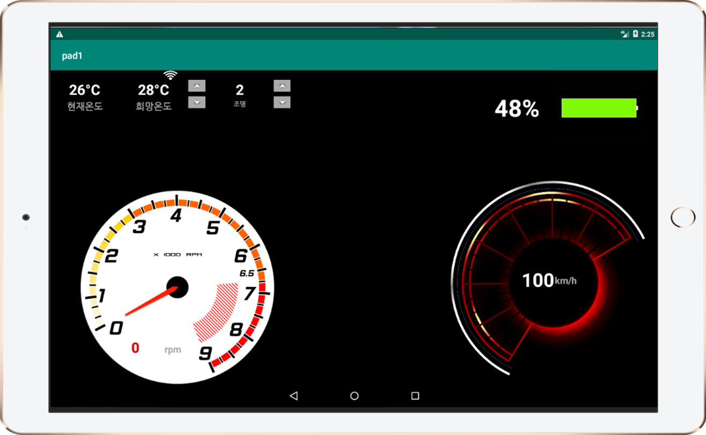

# Moyeora(모두의 여가 라이프) - CenterFascia
> 자율주행 자동차 카쉐어링을 통해 차량을 원하는 장소에서 빌리고 반납할 수 있는 서비스

## 프로젝트 설명
혁신성장 청년인재 프로젝트 (자율주행 카쉐어링 시스템) - 차량 센터페시아

## 서비스 구조도

## 구현된 기능
> - 자율주행 차량의 속도 및 RPM 확인
> - 차량 내 온도, 조명 조절 기능
> - 차량의 잔여 배터리 용량 확인

## 구현된 모듈 예시

자율주행 차량내 차량 센터페시아 구현 UI

## 역할 분담
* 차량 모듈과 통신 로직 개발 : 지민후
* 센터페시아 UI 개발 및 연동 : 오창영
* 차량 모듈과 통신 로직 개발 : 민필규

